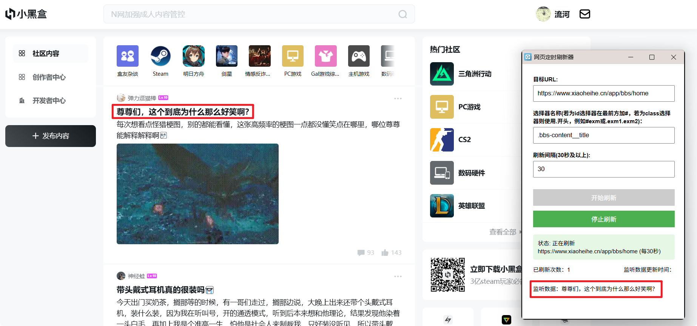
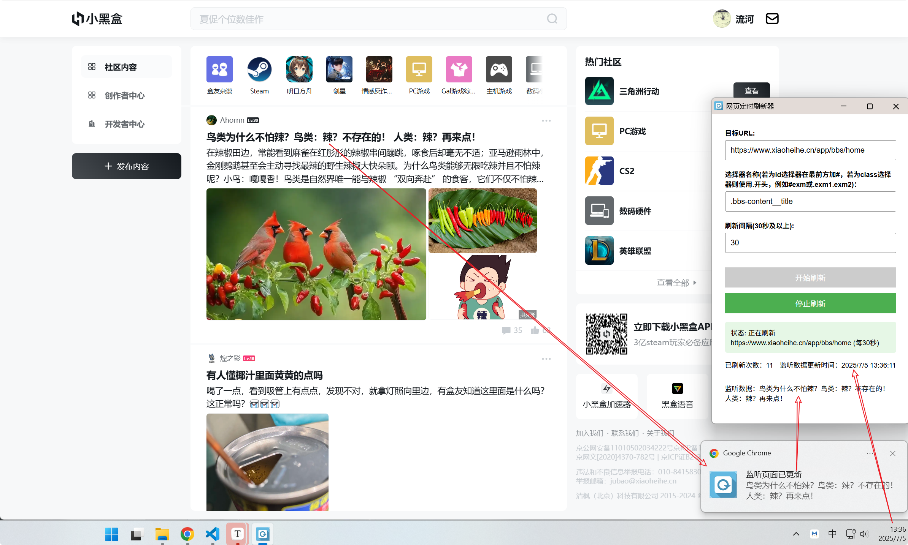

### **网页定时自动刷新**

两个相互独立的 Chrome 扩展（Manifest V3），核心均为「定时刷新网页 + 内容变更监听」：

- `base/` —— 通用网页定时刷新器：定时刷新任意网页，可用 CSS 选择器监听页面内容变更并弹出系统通知。
- `thswc/` —— 同花顺问财 / 雪球 / API 行情股票监控：在 base 的数据流模式上定制，解析股价 / 涨跌幅，达到预设阈值时通知；也支持不经页面、直接调用实时行情 API 批量刷新。

```text
web_auto_refresh/
├── base/       //【网页定时刷新器】基础插件（扁平结构）
├── thswc/      //【股票监控】问财 / 雪球 / API 行情插件
│   ├── background/  content/  popup/  shared/   // JS 按职责分目录
│   ├── js/                                      // 实时行情 API 模块（小石 / 新浪腾讯）
│   ├── icons/  popup.html  style.css  manifest.json
├── images/     // README 配图
├── CLAUDE.md   // 架构说明（供 AI 与开发者阅读）
├── LICENSE
└── README.md
```

#### 安装（两个扩展通用）

1. Chrome 打开 `chrome://extensions`
2. 右上角开启「开发者模式」
3. 点击「加载已解压的扩展程序」，选择 `base/` 或 `thswc/` 目录
4. 修改代码后在扩展卡片上点刷新；thswc 的弹窗是独立窗口，需关闭后点击扩展图标重新打开

#### 1、base

**功能**：

1. 定时刷新网页（间隔 30 秒及以上）
2. 非侵入式网页自动监听：根据 CSS 选择器指定网页内容，监听内容变更后弹出系统通知

**可应用于社交软件某位用户有新动态后弹窗提醒**，或以此代码为模板扩展数据变更后的自动化操作

**使用方式**：

1. 输入目标网页网址
2. 输入想监听内容的 CSS 选择器（可选；id 选择器以 `#` 开头，class 选择器以 `.` 开头，例如 `#exm` 或 `.exm1.exm2`）
3. 「第几项」可指定监听匹配结果中的第几条（可跳过置顶动态，默认第 1 项）
4. 输入刷新间隔（30 秒及以上），点击「开始刷新」；状态区显示刷新次数与监听到的数据

案例：小黑盒首条推荐内容监听



#### 2、thswc

> 📖 [查看详细文档](thswc/README.md)

监听问财 / 雪球的股票页面获取实时行情（也可不经页面、直接调用实时行情 API 批量获取），设置涨跌幅阈值，达到后浏览器消息实时提醒。

**功能**：

1. 多股票管理：股票列表 / 垃圾池双视图、分页、按当日或导入以来涨跌幅排序、置顶（新置顶排第 1，取消置顶落到未置顶首位）
2. 多种数据来源：同花顺问财、雪球（抓取解析按网址域名自动派发，同一列表可混用）；也可选择「调用 API 直取（不打开页面）」——定时监控直接用实时行情接口批量刷新（新浪/腾讯公开免 Key，或小石大数据需 Key）
3. 一键刷新全部组合：页面方式逐支打开刷新（随机间隔防反风控），或按全局配置走 API 批量获取
4. cron 定时全量刷新：全局设置最多配置 3 个 cron 表达式，到点自动刷新全部组合
5. 股价提醒：当日 / 导入以来双维度阈值，满足任一即通知（设置正数为涨破提醒，负数为跌破提醒，回区间后复位可再次提醒）
6. 初始价格：首次抓取自动回填当前价，导入以来涨跌幅以其为基准计算
7. 组合：数据可导入 / 导出为 JSON（按 URL 合并），导入导出均可登记为命名组合（不超过 4 字）；页脚首行「持仓组合」标签 + 导入导出图标 + 分页同行、组合卡片独立成行，一键切换组合；非活动组合可经 chip 内 × 删除（confirm 确认，活动组合须先切走；初始组合「默认」固定首位、不可删除）
8. 股票名称一键跳转对应站点（问财按名称搜索、雪球按代码进个股页）与复制

**使用方式**：

1. 选择「选择器名称」（同花顺问财 / 雪球 / 调用 API 直取），决定新增股票与快速打开的默认站点；选「调用 API 直取」时定时刷新走 API、不打开页面
2. 设置刷新间隔（30 秒及以上）
3. 点击 `+` 添加股票，仅需填写可正常访问的股票页地址：
   - 问财例：`https://www.iwencai.com/screener/result?w=002765&querytype=stock`
   - 雪球例：`https://xueqiu.com/S/SZ002765`
   - 地址中携带的 `&sign=...` 会在保存时自动截掉，不影响刷新匹配
   - API 直取模式需股票已有 6 位代码（首次抓取自动回填，或从问财/雪球页添加）
4. 点击「开始」，各股票名称 / 初始价 / 开盘价 / 现价 / 涨跌幅将自动抓取更新（API 模式经接口批量更新）
5. 点击列表行的编辑按钮进入详情页，设置股价提醒阈值；详情页可查看当日情况（右上角为最新刷新时间）与导入以来情况
6. 工具栏 🔄 一键刷新全部组合；全局设置中可配置数据获取方式、API Key 与 cron 定时全量刷新

**说明**：

- 关闭插件窗口会停止本轮监控，重新打开后点「开始」恢复
- 全部数据仅存于浏览器本地存储（chrome.storage），不上传任何服务器

【截图：thswc 主页（股票列表，含分页与组合切换）】

【截图：thswc 主页（垃圾池视图）】

【截图：股票详情 / 编辑页（股价提醒阈值设置）】

【截图：达到阈值后的浏览器系统通知】
