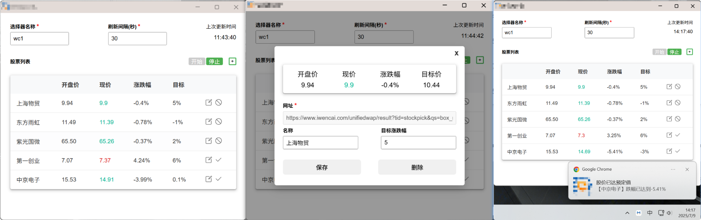

### **网页定时自动刷新**

结构：

```
web_auto_refresh/
├── base	//【网页定时刷新器】基础插件
├── thswc	//【xxx财经】某财经网站插件
├── LICENSE
└── README.md
```

#### 1、base

**功能**：

1、定时刷新网页

2、非侵入式网页自动监听（根据 css 选择器指定网页内容，监听内容变更后通知）

**可应用于社交软件某位用户有新动态后弹窗提醒**，或以此代码为模板扩展数据变更后的自动化操作

**使用方式**：

输入一个网页网址

输入想监听内容的 css 选择器（可选）

输入刷新间隔，30s 及以上

点击开始刷新

案例：小黑盒首条推荐内容监听


#### 2、thswc

对该网站进行监听，获取股票实时数据。

**功能**：

1、无需登录的无状态网页监听；

2、延迟刷新反风控；

3、设置指定涨跌幅，达到后浏览器消息实时提醒。（若设置正数，则股价超过后提醒，若设置负数，则股价跌破后提醒）

**使用方式**：

1、填写选择器名称：wc1

2、填写刷新间隔：30

3、+按钮添加股票，仅需填写可正常访问的网页地址

4、点击按钮“开始”

演示：




