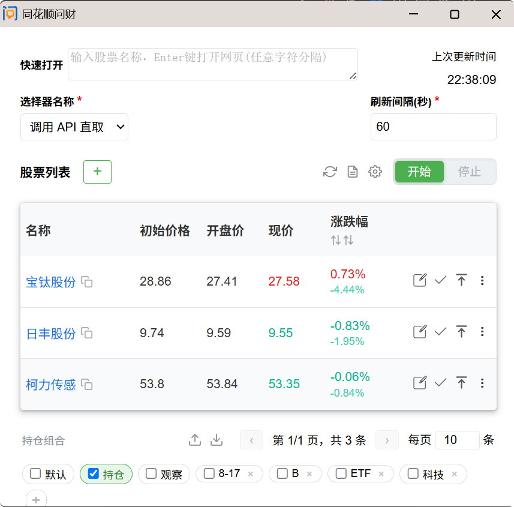
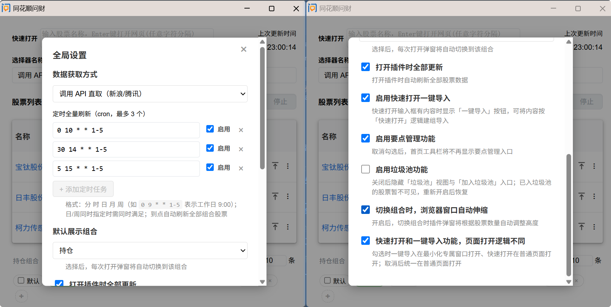
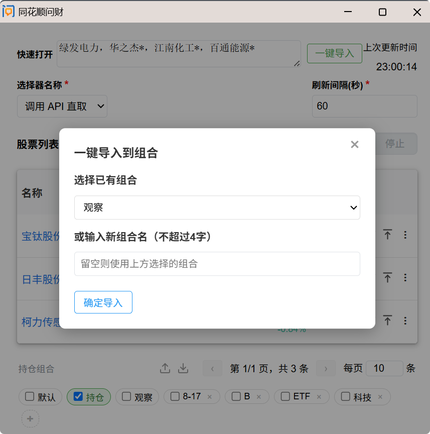
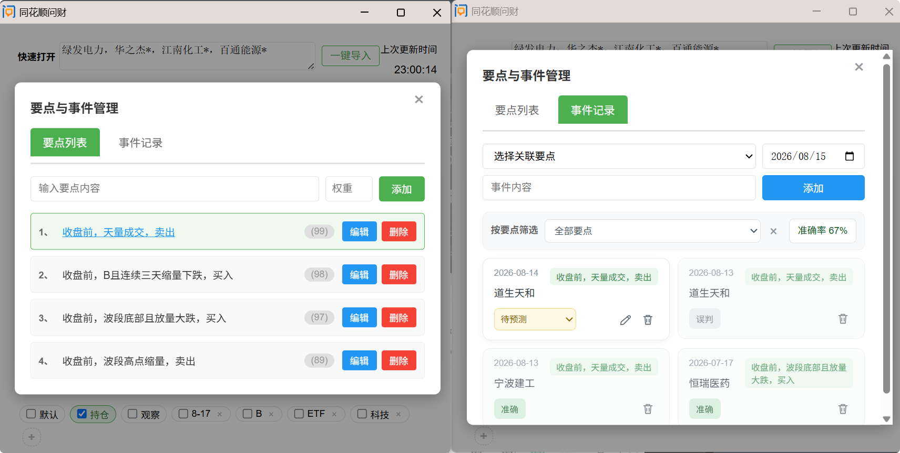

# thswc - 同花顺问财/雪球/API 行情 股票监控 Chrome 扩展

定时刷新股票页面，实时抓取价格数据，达到阈值时弹出系统通知。支持同花顺问财、雪球双站点，也可选择「调用 API 直取」模式不经页面、直接调用实时行情接口批量刷新。

## 核心功能

### 1. 多组合管理

- **三个默认组合**：「默认」「持仓」「观察」，按固定顺序排列，不可删除
- **自定义组合**：点击 `+` 按钮创建新组合，支持 1-4 字命名
- **组合切换**：点击组合标签快速切换，当前组合高亮显示
- **股票移动**：每行操作列按钮，一键将股票移动到其他组合

### 2. 实时价格监控

- **定时刷新**：可配置刷新间隔（最低 30 秒），使用 Chrome Alarms API 后台运行
- **多种数据来源**：
  - **同花顺问财**（iwencai.com）- 搜索页结果
  - **雪球**（xueqiu.com）- 个股详情页
  - **调用 API 直取（不打开页面）**：选择器选此项后，定时监控走全局配置的 API 方式批量获取行情，不打开任何页面
- **智能选择器**：按股票 URL 自动匹配对应站点的解析规则
- **ETF 自动识别**：159/51/58 开头的代码自动识别为 ETF，跳转雪球个股页

### 3. API 实时行情（数据获取方式）

全局设置中的「数据获取方式」决定 API 类刷新走哪个接口：

| 数据源                      | 说明                              | API Key              |
| --------------------------- | --------------------------------- | -------------------- |
| 刷新页面获取                | 默认逐支打开页面抓取              | 无                   |
| 调用 API 直取（小石大数据） | 小石批量行情接口                  | 需要，全局设置中填写 |
| 调用 API 直取（新浪/腾讯）  | 新浪主源 / 腾讯回退的公开行情接口 | 无需                 |

- 涨跌幅统一四舍五入到小数点后两位
- 一键刷新（🔄）与 cron 定时刷新均按此配置走页面或 API 方式
- 切换选择器为「调用 API 直取」后，**定时监控**也改用 API 批量刷新（仅当前视图、非停止的股票）

### 4. 一键刷新与 cron 定时全量刷新

- **一键刷新**（工具栏 🔄）：刷新全部组合的全部股票（含已停止的）——页面方式逐支打开（1.2-2.8s 随机间隔），或按全局数据获取方式走 API 批量获取
- **cron 定时全量刷新**：全局设置最多配置 3 个定时任务，5 字段 cron 表达式（分 时 日 月 周，如 `0 9 * * 1-5` 表示工作日 9:00；日/周同时指定时需同时满足），到点自动刷新全部组合股票

### 5. 快速打开与一键导入

- **快速打开**：输入股票名称按 Enter，按选择器打开对应网页（问财搜索 / 雪球搜索 / ETF 自动走雪球个股页）；输入内容中的中英文逗号、顿号、`*` 等会自动拆分剔除
- **一键导入**：快速打开框有内容时出现「一键导入」按钮——弹窗可**下拉选择已有组合**（含默认组合）或**输入新组合名**，将输入内容按快速打开逻辑建组导入（按名称去重、同名跳过），页面逐个延迟打开
- **页面打开方式**：默认一键导入在最小化专属窗口打开（与「开始」刷新一致）、快速打开在普通页面打开；可在全局设置关闭「页面打开逻辑不同」改为统一普通页面打开

### 6. 阈值通知

- **当日涨跌幅阈值**：设定上下限（如 -3% / +5%），触发时弹出系统通知
- **导入以来涨跌幅阈值**：基于首次抓取价格计算累计涨跌幅，独立通知
- **通知锁存**：同一阈值触发后不重复通知，避免骚扰

### 7. 反风控机制

- **专属 Chrome 窗口**：页面刷新在独立窗口中进行，不干扰日常浏览
- **随机延迟**：全量刷新逐支打开间隔 1.2-2.8s 随机，定时调度每支 1.2-3.5s 随机，错开请求
- **后台刷新**：标签页在后台打开和刷新，不抢占焦点

### 8. 全局设置

- **设置入口**：工具栏 ⚙️ 图标，点击打开全局设置弹窗（内容超长时可滚动）
- **数据获取方式**：刷新页面 / 小石大数据 / 新浪腾讯（顶部，决定 API 刷新走哪个接口）
- **API Key**：选「小石大数据」时显示，可经 ↗ 跳转小石官网获取；仅存本地、不随导出备份
- **定时全量刷新（cron）**：最多 3 个 cron 表达式
- **打开插件时全部更新**：默认勾选，打开插件自动全量刷新股票数据
- **启用快速打开一键导入**：默认勾选
- **页面打开逻辑不同**：默认勾选，一键导入在最小化专属窗口打开、快速打开在普通页面打开；取消后统一在普通页面打开
- **启用要点管理功能**：默认勾选
- **启用垃圾池功能**：默认勾选
- **弹窗自动伸缩**：开启后，切换组合/视图/增减股票时，插件弹窗根据当前股票数量自动调整高度
- **默认显示组合**：选择每次打开插件时自动切换到哪个组合（股票页），默认「持仓」

### 9. 数据管理

- **全量备份**：一键导出插件全部数据（所有组合、要点、事件、设置）
- **全量恢复**：导入备份文件，覆盖恢复所有数据
- **数据持久化**：Chrome Storage API 本地存储，关闭浏览器不丢失

### 10. 要点与事件管理

- **要点管理**：记录交易逻辑和观察要点，按权重排序
- **事件记录**：基于要点创建预测事件，跟踪验证准确性
- **状态追踪**：事件支持三种状态（待预测 → 准确/误判）
- **归档**：仅「准确」/「误判」可归档，归档后状态保留、不可再编辑；**只有已归档的事件才按日期/要点/状态合并为同一卡片**，未归档事件每条独立显示
- **准确率**：筛选行右侧展示「准确率 = 已归档且准确 / 已归档」，随当前要点筛选联动
- 归档后状态标签按结果着色：准确=浅绿，误判=灰

**要点与事件使用流程**：

1. 点击工具栏 `📄` 图标打开要点与事件管理弹窗
2. 在「要点列表」标签页添加要点（如「大跌缩量」，权重 10）
3. 切换到「事件记录」标签页，选择关联要点，输入事件内容（如「恒瑞医药机会 7.17 待评测」），选择日期
4. 等待市场验证后，将事件状态切换为「准确」或「误判」，可归档合并
5. 通过事件回顾总结交易逻辑的有效性

### 11. 股票列表管理

- **编辑功能**：修改股票名称、代码、URL、初始价格、阈值等
- **启停控制**：单只股票可暂停监控，不参与定时刷新
- **置顶功能**：重要股票置顶显示，支持多级置顶排序
- **垃圾池**：暂不监控的股票移入垃圾池，保留数据但不刷新
- **排序切换**：按当日涨跌幅或导入以来涨跌幅升序/降序排列
- **分页显示**：自定义每页条数（默认 10 条），避免列表过长

## 界面预览

主界面 - 股票列表（组合切换 + 分页）


全局设置


一键导入组合选择


要点与事件管理


### 主界面

- 股票列表：名称、初始价、开盘价、现价、当日涨跌幅、导入以来涨跌幅
- 操作列：编辑、启停、置顶、切换组合
- 工具栏：添加、一键刷新、要点管理、全局设置、开始/停止
- 底部：组合标签、导入导出、分页控制

### 编辑弹窗

- 基本信息：名称、代码、URL、最后更新时间
- 价格信息：现价、开盘价、涨跌幅
- 阈值设置：当日涨跌幅上下限、导入以来涨跌幅上下限
- 操作按钮：删除、移入垃圾池、保存

## 使用方法

1. **安装扩展**：Chrome 打开 `chrome://extensions` → 开启开发者模式 → 加载已解压的扩展程序 → 选择 `thswc/` 目录
2. **添加股票**：点击顶部输入框，输入问财搜索 URL 或雪球个股 URL，回车添加
3. **开始监控**：设置刷新间隔（秒），点击「开始监控」按钮
   - 选择器选「调用 API 直取」时走 API 批量刷新，不打开页面（需股票已有 6 位代码）
4. **设置阈值**：编辑股票，设置当日/导入以来涨跌幅阈值
5. **管理组合**：点击底部组合标签切换，点击 `+` 新建组合
6. **全局设置**：配置数据获取方式、API Key、cron 定时全量刷新

## 技术栈

- **Manifest V3**：Chrome 扩展最新规范
- **原生 ES2020**：无构建系统，无依赖库
- **Chrome APIs**：Alarms、Storage、Tabs、Windows、Notifications、Scripting
- **实时行情 API**：小石大数据（需 Key）、新浪/腾讯公开行情接口

## 项目结构

```text
thswc/
├── background/
│   └── background.js      # Service Worker：定时刷新调度、cron、专属窗口、API 分派
├── popup/
│   ├── popup.js           # 弹窗主逻辑：数据解析、组合管理、UI 交互、API 行情落地
│   ├── render.js          # 渲染函数：股票列表、组合标签、分页
│   ├── parsers.js         # 解析规则：问财/雪球 DOM 选择器
│   ├── notifications.js   # 通知逻辑：阈值判断、通知弹出
│   └── editform.js        # 编辑表单：表单渲染、字段联动
├── content/
│   └── content.js         # Content Script：抓取页面 HTML 发送给 background
├── shared/
│   ├── utils.js           # 工具函数：时间格式化、Mutex、URL 处理
│   └── cron.js            # cron 表达式解析与下次触发时间计算
├── js/
│   ├── xiaoshi_realtime_quote.js   # 小石大数据批量行情（ES module）
│   ├── adata_realtime_quote.js     # 新浪/腾讯实时行情（ES module）
│   └── quote_batch.js              # 小石批量行情 Node 命令行脚本
├── icons/                 # 图标资源
├── popup.html             # 弹窗界面
├── style.css              # 样式表
└── manifest.json          # 扩展配置
```

## 注意事项

- 刷新间隔建议 ≥ 60 秒，避免触发站点反爬机制
- 问财搜索结果页 URL 会动态变化，扩展自动处理
- ETF 代码（159/51/58 开头）自动跳转雪球，问财不支持 ETF 查询
- 弹窗关闭期间数据不会处理，重新打开后恢复最新状态
- API 直取（新浪/腾讯）无开盘价字段，开盘价保持原值不更新；小石/新浪/腾讯接口均仅支持 A股
